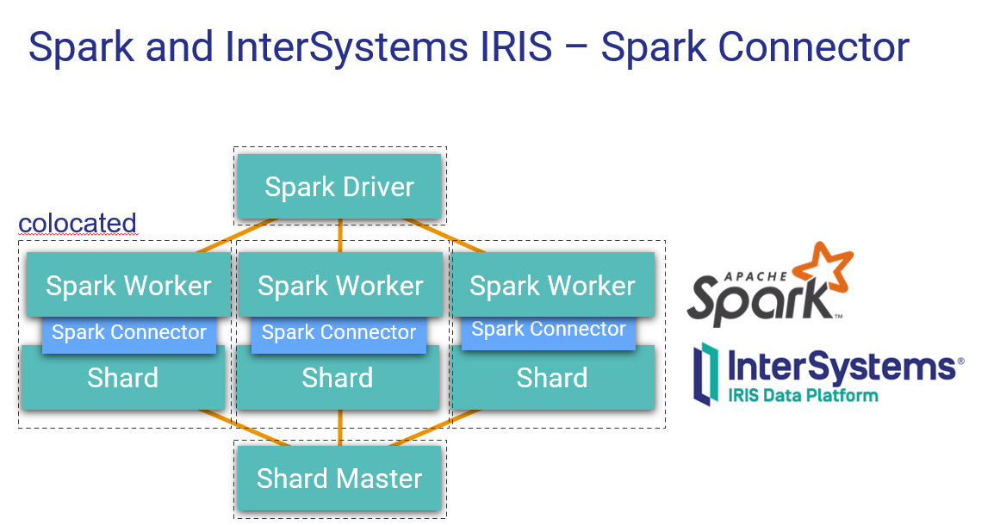

# workshop
InterSystems IRISとKafka, Apache Sparkとの連携方法をご紹介するものです。

# PEXとは

[オンラインドキュメント](https://docs.intersystems.com/iris20211/csp/docbookj/DocBook.UI.Page.cls?KEY=EPEX_intro)からの抜粋。  

> Production EXtension (PEX) フレームワークでは、相互運用プロダクションの開発時に実装言語を選択できます。相互運用プロダクションにより、メッセージ形式や通信プロトコルが異なる複数のシステムを統合できます。

IRISのインターオペラビリティ機能を、様々なプログラミング言語(Java, .NET, Python(予定))から利用できるように拡張するものです。これにより、各言語が持つ広範なライブラリ群を使用して、インターオペラビリティ機能の主要コンポーネントであるビジネスサービス、ビジネスオペレーション、ビジネスプロセス、アダプタを作成できるようになります。PEX導入以前は、ObjectScriptの使用が必須でした。下記は、その使用例になります。

# kafkaとの連携方法
下記の用法が可能です。  
1. kafkaのコンシューマからJDBCでIRISにアクセス
2. kafkaのコンシューマからPEX機能でIRISと連携
3. kafkaのプロデューサーをPEX機能で呼び出す

# PEXによるKafka連携 

## シンプルな使用例
構造を理解いただくことを目的としたシンプルな例です。  
IRISはCommunity Editionを使用していますので、Docker環境(Linux)があれば動作します。    
https://github.com/IRISMeister/pex-demo/blob/master/MEMO-JP.md  

## 高度な使用例
金融機関のPoCで使用したモデルを基にした例です。  
IRISはCommunity Editionを使用していますので、Docker環境(Linux)があれば動作します。    
https://github.com/IRISMeister/irisdemo-demo-kafka

## オンラインラーニングサイト
下記を使用して、オンライン上の実行環境を作成して学習することが出来ます。  
https://learning.intersystems.com/course/view.php?id=1668

# Apache Sparkとの連携方法
下記の用法が可能です。  
1. JDBCによるアクセスアクセス  
指定したクエリ結果からDataFrameの作成、DataFrameのIRISへの保存を実行します。  
https://spark.apache.org/docs/latest/sql-data-sources-jdbc.html

2. Spark Connectorによるアクセス
IRIS用のSpark Connectorを使用出来ます。JDBCに比べて、述語のプッシュダウン、シャード対応、暗黙的な並列処理といった利点があります。  
https://docs.intersystems.com/iris20211/csp/docbookj/DocBook.UI.Page.cls?KEY=BSPK_INTRO  
特にシャード環境で効果を発揮します。以下は、その解説ビデオです。  
https://learning.intersystems.com/course/view.php?id=1152

## シンプルな使用例
構造を理解いただくことを目的としたシンプルな例です。  
IRISはCommunity Editionを使用していますので、Docker環境(Linux)があれば動作します。    
https://github.com/IRISMeister/irisdemo-demo-spark

## 高度な使用例
病院への再入院リスクの予測を行うデモです。SparkでIRIS上のデータを使用してPMMLモデルを作成し、IRISのPMML実行環境に反映させます。  
IRISはCommunity Editionを使用していますので、Docker環境(Linux)があれば動作します。    
https://community.intersystems.com/post/readmission-demo-20-here-and-it-open-source-now

## オンラインラーニングサイト
下記を使用して、オンライン上の実行環境を作成して学習することが出来ます。IRISに保存されたNYCのタクシーの利用に関するオープンデータをZeppelin+Sparkで分析することが出来ます。
> 上記の「シンプルな使用例」はこちら内容の抜粋を最新バージョンに変更しコンテナ化したものです。  
https://learning.intersystems.com/course/view.php?id=796

## Community記事  
IRIS, Spark, Zeppelinをコンテナで実行する記事です。  
https://community.intersystems.com/post/containerized-machine-learning-playground-intersystems-iris-community-edition-spark-and
